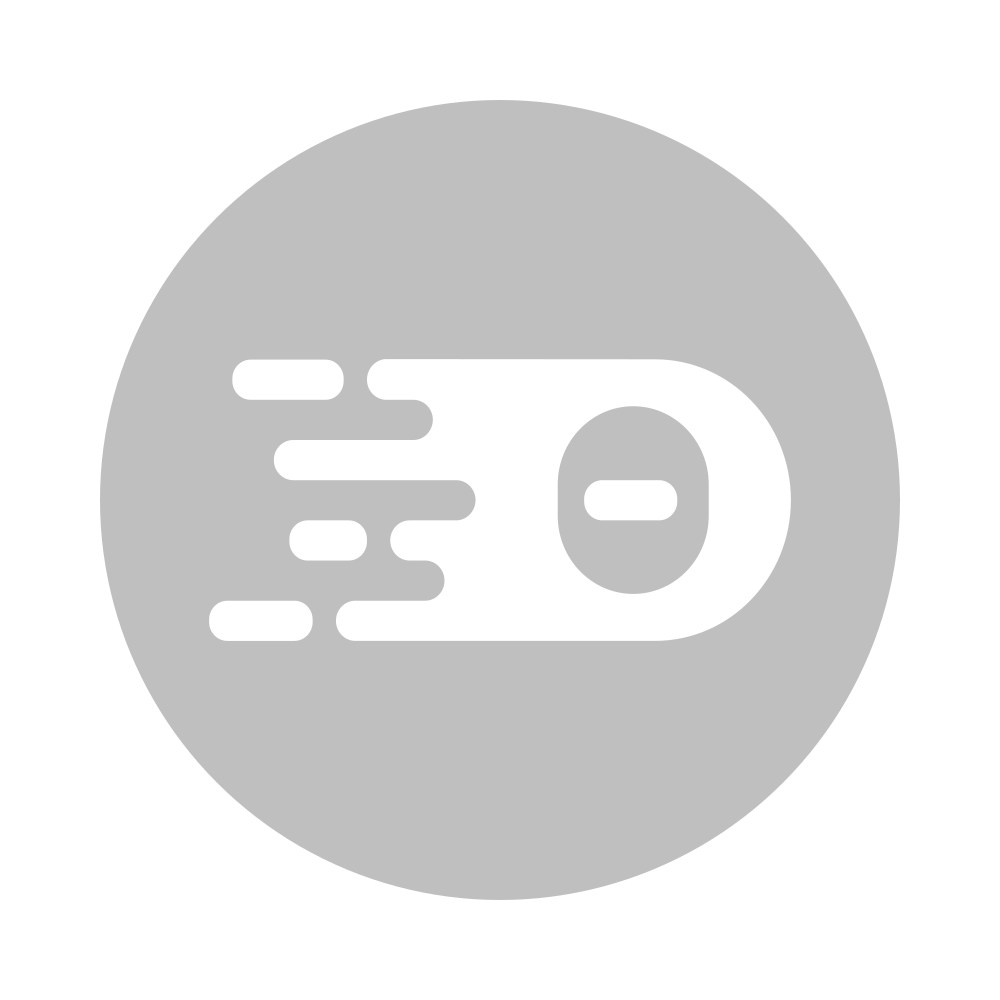

<div align='center'>

<br />

<br />

<h2>THEIA VISUAL DEBUG DEMO EXTENSION</h2>

---

</div>

**`DESCRIPTION`**

A demo debug extension used to visualize a debug session in Theia.

**`KEY FEATURES`**

1. Contributes visual changes to Theia's status-bar by changing it's color whenever presently in an active debug session.
2. Contributes a new status-bar item to re-play the current debug configuration once a debug session has been previously started.

**`HOW TO TEST`**
1. Install [prerequisites](https://github.com/theia-ide/theia/blob/master/doc/Developing.md#prerequisites).
2. Clone the repository.
3. Perform `yarn` at the root of the repository.
4. Test the `browser` or `electron` application by running:

    **browser**
    ```console
    (yarn rebuild:browser && cd browser-app && yarn start)
    ```

    **electron**
    ```console
    (yarn rebuild:electron && cd electron-app && yarn start)
    ```
5. Run a debug configuration in Theia, starting a debug session.